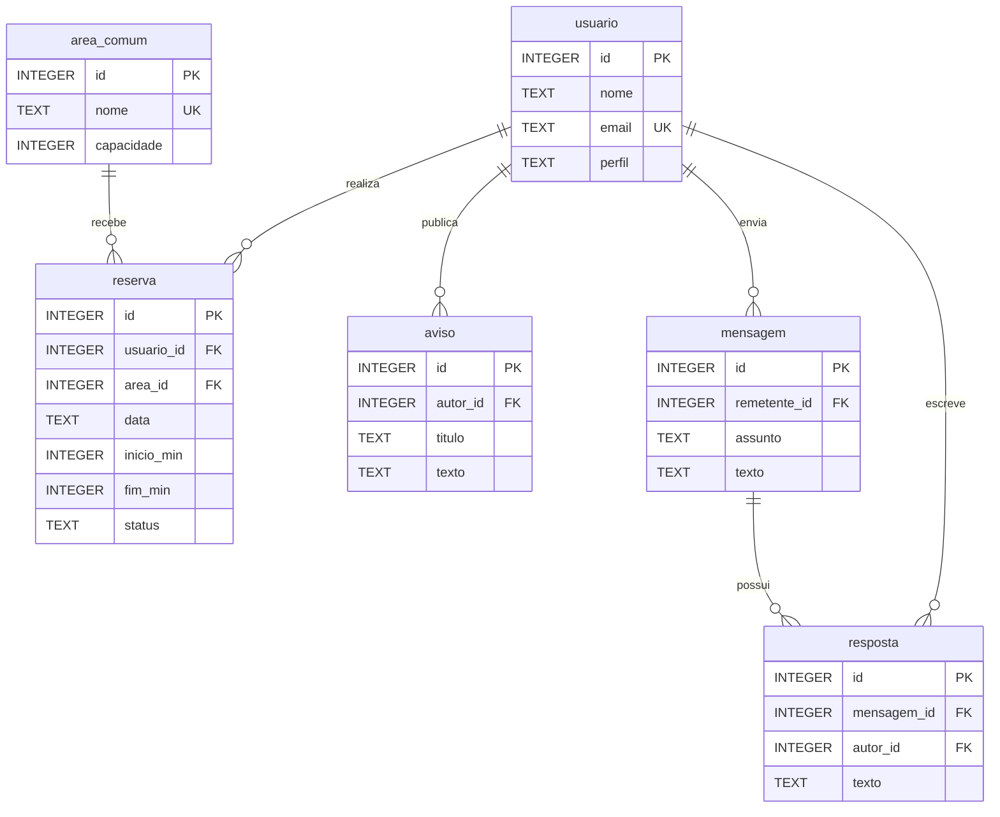

# Banco de dados do CondoFácil

Projeto Integrador de Tecnologia da Informação II, UFMS Digital, 2026.2.

## Executar

Na raiz do repositório, com Python 3.10+ e SQLite 3.37+:

```sh
python database/executar.py
```

Não exige instalação de bibliotecas. O módulo `sqlite3` faz parte da biblioteca padrão do Python; sua versão de SQLite depende da distribuição instalada. O programa verifica a versão e cria um **novo** banco em `database/gerados/execucao-.../condofacil.sqlite3`, junto ao resultado em JSON. Não apaga bancos anteriores. Execução validada com Python 3.12.14 e SQLite 3.53.1: **22 verificações aprovadas**. O arquivo `resultado_validacao.json` contém a evidência dessa execução.

Também é possível abrir um banco vazio em ferramenta SQLite e executar, na ordem, `01_schema.sql`, `02_dados.sql` e `03_operacoes.sql`. Ative `PRAGMA foreign_keys=ON` em toda conexão. Os scripts de criação e carga são destinados a banco novo, não a reaplicação em um banco já preenchido.

## Organização

| Arquivo | Finalidade |
|---|---|
| 01_schema.sql | Seis tabelas STRICT, chaves, índices e gatilhos de conflito |
| 02_dados.sql | Carga fictícia e determinística |
| 03_operacoes.sql | INSERT, UPDATE, DELETE, JOIN, LEFT JOIN e GROUP BY |
| executar.py | Execução dos scripts, testes de integridade e evidências |
| resultado_validacao.json | Resultado técnico reproduzível, sem dados reais |
| .gitignore | Exclui bancos gerados e arquivos temporários do versionamento |

## Modelo de dados



Cada filho possui exatamente um registro em cada relacionamento indicado por chave estrangeira; cada pai pode ter zero ou muitos filhos. `reserva` associa usuários e áreas ao longo do tempo. O modelo atende um único condomínio. Não inclui pagamentos, portaria, múltiplos condomínios ou cadastro de unidades.

## Normalização e regras

- Atributos atômicos, sem listas dentro de colunas; respostas em tabela própria (1FN).
- Atributos não chave dependem da chave inteira; chaves primárias simples (2FN).
- Nome do usuário e nome da área não se repetem na reserva; são obtidos por JOIN, evitando dependências transitivas (3FN, dentro das regras declaradas).
- Email único com comparação `NOCASE` do SQLite (case folding ASCII), nomes de áreas únicos e capacidade positiva.
- Datas ISO válidas (`AAAA-MM-DD`), horários em minutos desde meia-noite e intervalo permitido de 08h a 22h. A regra de data futura pertence à futura camada de serviço; o banco admite históricos.
- Reservas ativas usam intervalo `[início,fim)`: 10h-12h e 12h-14h são compatíveis. Os gatilhos verificam INSERT e UPDATE, inclusive reativação e mudança de área/data.
- Usuários e áreas referenciados não podem ser removidos (`RESTRICT`). Remover uma mensagem elimina suas respostas (`CASCADE`), regra demonstrada com registros descartáveis. Na operação real, revisar retenção e exclusão antes de adotar essa política.
- Transações agrupam criação, carga e manipulação; testes usam SAVEPOINT para reverter somente seus dados temporários.

## Resultados

A carga inicial tem 3 usuários, 3 áreas, 2 reservas, 1 aviso, 1 mensagem e 1 resposta. O exemplo inclui a reserva 3, cancela a reserva 2 e cria/exclui uma mensagem temporária com sua resposta. Ao final: 3 reservas (2 ativas, 1 cancelada), 1 mensagem e 1 resposta.

Agenda ativa: Marina Demo, salão, 10/10/2026, 10h-12h; Alex Demo, salão, 10/10/2026, 12h-14h. A consulta agregada retorna salão = 2, churrasqueira = 0 e quadra = 0. Os testes cobrem conflitos, vínculos inexistentes, data impossível, horários inválidos, duplicidade, tipos, exclusão restrita/cascata e integridade.

## Versionamento

Etapa desenvolvida na branch `codex/banco-dados-modulo3`, em commits por finalidade: modelagem/documentação, esquema/operações e verificação/evidências. Integração por pull request para `main`. O histórico registra evolução técnica real, sem simular datas ou autoria de participantes. Uma revisão pelo próprio autor não equivale a revisão independente.

Para continuar localmente:

```sh
git clone https://github.com/ayrtonoliveira-lgtm/condofacil.git
cd condofacil
git switch -c melhoria-banco
python database/executar.py
git diff
git add database
git commit -m "fix(db): descrever a regra corrigida"
git push -u origin melhoria-banco
```

## Limites e evolução

Este banco executa localmente e **ainda não está integrado à interface**. O site no GitHub Pages continua usando localStorage. Não há API, autenticação real ou teste de carga concorrente nesta entrega. O campo perfil representa dados, não uma barreira de autorização; a futura API deverá verificar a identidade e restringir publicação de avisos e respostas. SQLite não substitui esses controles. Os gatilhos foram testados funcionalmente, não como certificação de segurança ou desempenho.

Não usar dados reais. Contas `example.invalid` e nomes Demo são fictícios. Não houve entrevistas nem validação com moradores. Próximas etapas: API com autorização, teste de transações entre conexões concorrentes, migrações versionadas e avaliação com usuários. Para alta concorrência de escrita, reavaliar PostgreSQL ou outro banco cliente-servidor.

## Referências

- [SQLite: CREATE TABLE](https://www.sqlite.org/lang_createtable.html)
- [SQLite: chaves estrangeiras](https://www.sqlite.org/foreignkeys.html)
- [SQLite: gatilhos](https://www.sqlite.org/lang_createtrigger.html)
- [SQLite: tabelas STRICT](https://www.sqlite.org/stricttables.html)
- [SQLite: usos apropriados](https://www.sqlite.org/whentouse.html)
- [Microsoft: normalização](https://learn.microsoft.com/en-us/previous-versions/troubleshoot/microsoft-365/microsoft-365-apps/access/database-normalization-description)
- [Pro Git: branches e merges](https://git-scm.com/book/pt-br/v2/Appendix-C%3A-Comandos-do-Git-Branches-e-Merges)
